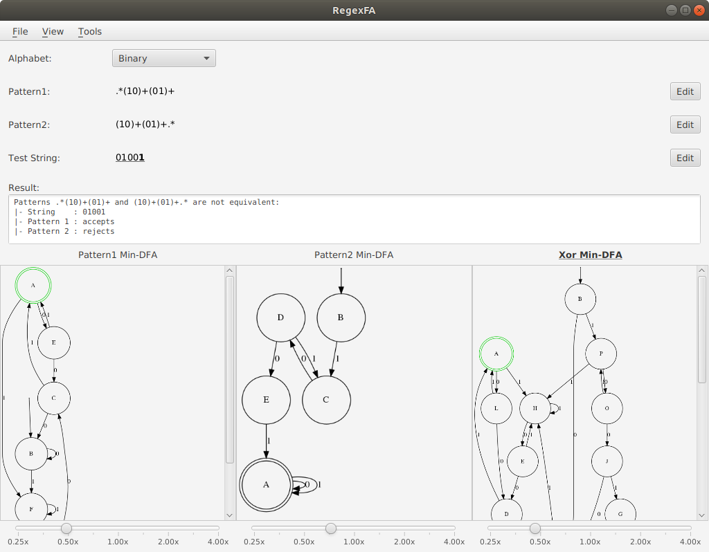

# RegexFA
Convert a small subset of regex to NFA/ DFA/ Min-DFA

Supports
- Groups `(abc)`
- Alternatives `a|b`
- Greedy quantifiers `*`, `+`, `?`
- Curly bracket quantifiers `{m}`, `{m,}`, `{m, n}`
- Metacharacter `.`
- Bracket expression `[aq]`, `[a-z]`, `[^0-3a]`

Note that it can only determine whether the regex expression accepts the whole test string, i.e. whether `^<regex>$` accepts `<test-string>`.
It does not determine the strings captured by each group.

Taking from https://stackoverflow.com/a/32760631, the grammar should be:
```
<expression>     ::= <term> '|' <expression>
                   | <term>
                   | ''
<term>           ::= <factor> <term>
                   | <factor>
<factor>         ::= <atom> <quantifier>
                   | <atom>
<atom>           ::= <char>
                   | '.'
                   | '(' <expression> ')'
                   | '[' <char-set>']'
                   | '[' '^' <char-set>']'
<quantifier>     ::= '*'
                   | '+'
                   | '?'
                   | '{' <number> '}'
                   | '{' <number> ',' '}'
                   | '{' <number> ',' <number> '}'
<char-set>       ::= <char> <char-set>
                   | <char> '-' <char> <char-set>
                   | <char>
                   | <char> '-' <char>
<number>         ::= <number> <digit>
                   | <digit>
```
where `<char>` represents a character in the chosen alphabet, and `<digit>` represents a decimal digit.

## Dependencies
Maven is used to manage dependencies. See [pom.xml](pom.xml)

## Runtime Dependencies
You need to install `graphviz` on your computer and configure the PATH so that the `dot` command is available.
You can download the installation files for your platform from the [official website](https://www.graphviz.org/), or install it using your package manager, e.g.: 

Ubuntu:
```
apt-get install graphviz
```

Mac (homebrew):
```
brew install graphviz
```

## Build
```
mvn clean compile
```

## Run
```
mvn javafx:run
```

## Screenshots

