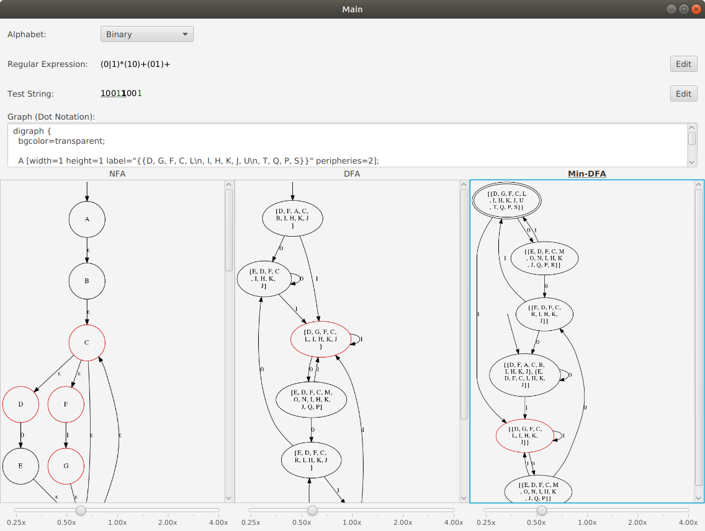

# RegexFA
Convert a small subset of regex to NFA/ DFA/ Min-DFA

Supports
- Greedy quantifiers `*`, `+`, `?`
- Curly bracker quantifiers `{m}`, `{m,}`, `{m, n}`
- Metacharacter `.`
- Groups
- Alternatives

Taking from https://stackoverflow.com/a/32760631, the grammar should be:
```
<expression>     ::= <term> '|' <expression>
                   | <term>
<term>           ::= <factor> <term>
                   | <factor>
<factor>         ::= <atom> <quantifier>
                   | <atom>
<atom>           ::= <char>
                   | '.'
                   | '(' <expression> ')'
<quantifier>     ::= '*'
                   | '+'
                   | '?'
                   | '{' <number> '}'
                   | '{' <number> ',' '}'
                   | '{' <number> ',' <number> '}'
<number>         ::= <number> <digit>
                   | <digit>
```
where `<char>` represents the set of characters of the chosen alphabet, and `<digit>` represents the set of decimal digits.

## Dependencies
Maven is used to manage dependencies. See [pom.xml](pom.xml)

## Runtime Dependencies
You need to install [graphviz](https://www.graphviz.org/) on your computer and configure the PATH so that the `dot` command is available.

You can download the relevant installation files for your platform or install it using your package manager, for example: 

Ubuntu:
```
apt-get install graphviz
```

Mac (homebrew):
```
brew install graphviz
```

## Build
```
mvn clean compile
```

## Run
```
mvn javafx:run
```

## Screenshot

