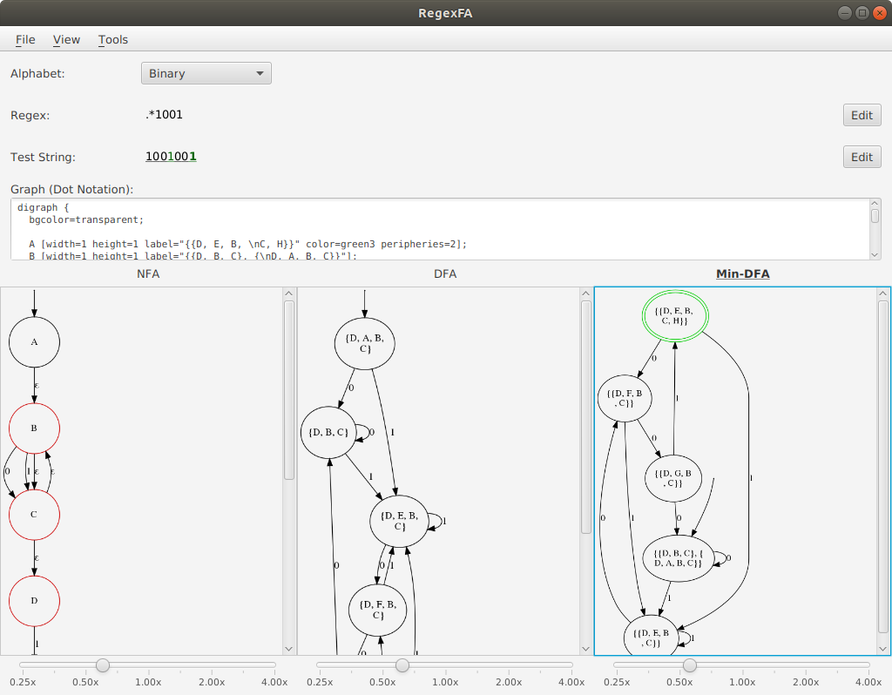

# RegexFA
Convert a minimal subset of regex to NFA/ DFA/ Min-DFA

Supports
- Greedy quantifiers *, +, ?
- Groups
- Alternatives

Taking from https://stackoverflow.com/a/32760631, the grammar should be:
```
<expression> ::= <term> '|' <expression>
               | <term>
<term>       ::= <factor> <term>
               | <factor>
<factor>     ::= <atom> '*'
               | <atom> '+'
               | <atom> '?'
               | <atom>
<atom>       ::= <char>
               | '(' <expression> ')'
```

## Dependencies
Maven is used to manage dependencies. See [pom.xml](pom.xml)

## Runtime Dependencies
You need to install [graphviz](https://www.graphviz.org/) on your computer and configure the PATH so that the `dot` command is available.

You can download the relevant installation files for your platform or install it using your package manager, for example: 

Ubuntu:
```
apt-get install graphviz
```

Mac (homebrew):
```
brew install graphviz
```

## Build
```
mvn clean compile
```

## Run
```
mvn javafx:run
```

## Screenshot

